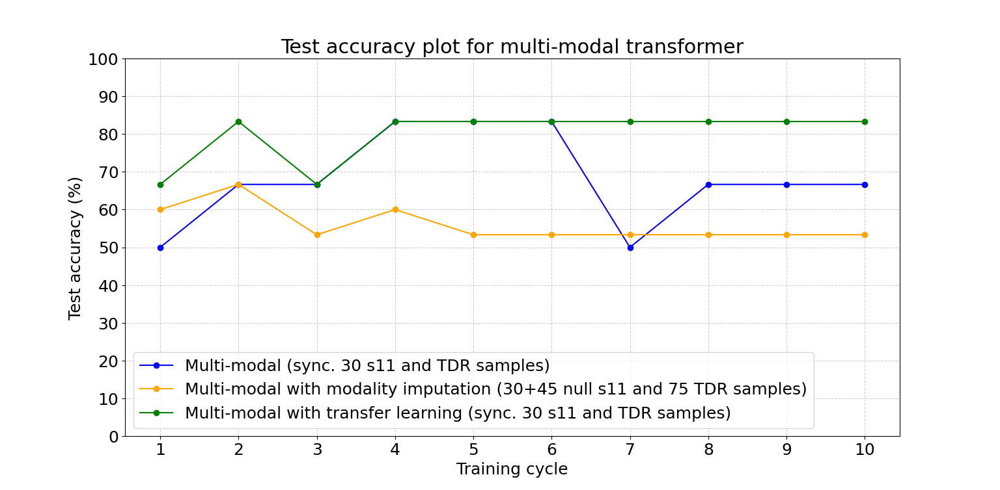
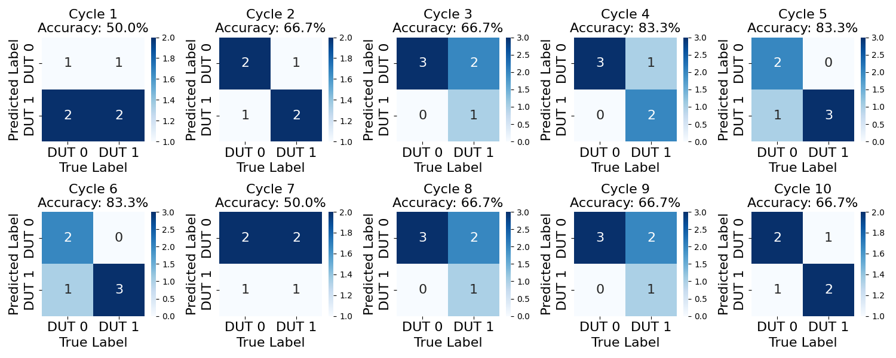
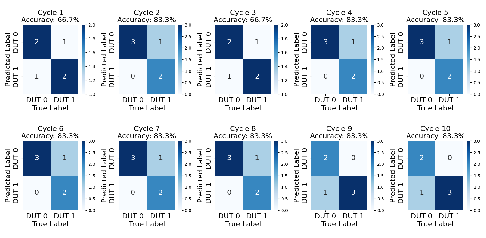
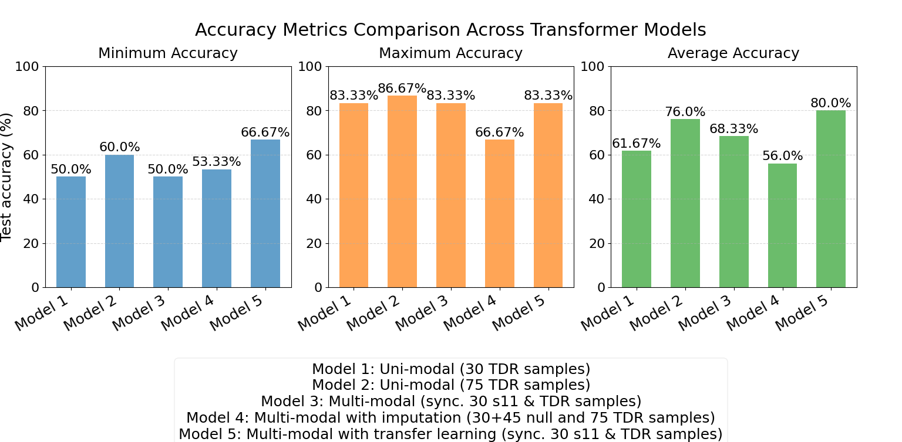

# Automated-Sensor-Fusion-for-Failure-Detection-in-Power-Semiconductor
Master thesis

## 📄 Abstract

The complexity, heterogeneity and multimodal nature of the data involved make failure analysis of power semiconductor devices extremely difficult. Traditional failure analysis methods frequently depend on the utilization of single-modal data, which can result in suboptimal detection accuracy and required extensive manual pre-processing. In order to improve failure classification in Gallium Nitride (GaN) High Electron Mobility Transistors (HEMT), this thesis explores the application of automated sensor fusion approaches, through integration of time-domain reflection (TDR) signals and S-parameter data.

The aim of this thesis is to create an AI-based approach for failure classification in Transistor. In addition, to implement a method to automate data synchronization, normalization, and fusion procedures. By using a Transformer model for failure classification, the algorithm improves the accuracy for failure classification when examined with Uni-modal (TDR data) and Multi-modal (synchronized s-parameter and TDR data). A functionality is created with input of raw s-parameter and TDR data files, creates a dataset which can be directly used for the classification task. This functionality creates a unified multimodal data, and it is normalized for the transformer model. Furthermore, the manual efforts in data preprocessing is reduced by implementing automated sensor data fusion. The implemented Transformer model shows an improvement of 6.67% with synchronized data over TDR data and the model accuracy improves by 11.67% with the use of transfer learning.

## 📊 Results

# Uni-modal transformer performance evaluation

The Uni-modal transformer model performance is evaluated on 2 datasets.

- Synchronized TDR dataset of 30 samples
- Entire TDR dataset of 75 samples

The purpose of using these two datasets is to evaluate the model's performance and based on this analysis, determine the strategy for the Multi-modal transformer. The dataset is split into three groups for training and testing, as shown in the Table. 

|  | Training dataset | Validation dataset |  Test dataset |
|-----------------|------------|--------------|--------------|
| TDR 30 samples dataset | 18 | 6 | 6 |
| TDR 75 samples dataset | 45 | 15 | 15 |

Figure 1 illustrates the test accuracy of both models over 10 training cycles. The test results indicate varying levels of accuracy depending on the number of training epochs used. The highest recorded test accuracy for the Uni-modal transformer with the synchronized TDR 30 samples is 83.33\%, observed at one instance. For the TDR dataset containing 75 samples, the model exhibited improved average accuracy. The highest recorded test accuracy for this dataset is 86.67\%, also achieved in multiple test runs. This improvement in accuracy with an increased sample size suggests that a larger dataset contributes to better model generalization.

| Figure 1: Test accuracy results for Uni-modal transformer |

| Figure 2: Confusion matrix for Uni-modal transformer(TDR 30 samples) |

To further analyze the model’s predictions, confusion matrices for synchronized TDR data are presented for each training cycle  in Figure 2. These matrices provide insight into the model’s classification performance, illustrating the number of correct and incorrect predictions over 10 training cycles.

 In most cases, the model performs well but most of the training cycles the test accuracy fluctuates between 50\% and 66.67\%. On average, the model achieves 61.67\% accuracy on synchronized TDR 30 samples, which suggests that the dataset size may be a limiting factor in achieving higher performance. 

The test accuracy improved with increased sample size, suggesting that a larger dataset contributes to better model generalization. Focusing on results of 30 synchronized TDR samples, the model performance is very average, with average test accuracy of 61.67\%.

Although model performs very good with TDR 75 samples, the usability of the entire TDR dataset is not possible. The reason is synchronized s11 samples which are limited to 30. This model performance shows that the transformer is suitable for the given dataset. Also transformer models embedding and encoder layer are adequate at feature selection. Now, this model is further modified to adapt s11 data in Multi-modal model. This result of synchronized TDR samples serves as the base for comparison for multi-modal transformer results and the multi-modal models must exhibit improvement in accuracy to prove usability of multi-modal data over uni-modal data.

# Multi-modal transformer performance evaluation

The multi-modal transformer model performance is evaluated on 3 different configurations.

- Synchronized s11 and TDR dataset of 30 samples with Multi-modal transformer model
- 30 synchronized + 45 null s11 and 75 TDR dataset with Multi-modal transformer model with modality imputation
- Synchronized s11 and TDR dataset of 30 samples with pre-trained Multi-modal transformer model with transfer learning

The Figure 3 compares the test accuracy of a multi-modal transformer model across above mentioned configurations. The synchronized approach (30 s11 and TDR samples) serves as the baseline, combining both modalities without modifications. The imputation variant (30+45 null s11 and 75 TDR samples) is to handle missing data by artificially introducing null samples while increasing the volume of another modality. The transfer learning configuration (sync. 30 s11 and TDR samples) leverages pre-trained knowledge to improve performance on synchronized s11 and \gls{tdr} dataset.

Among the three configurations, the multi-modal transformer with transfer learning likely achieves the highest test accuracy, as pre-trained features enhances generalization even with synchronized data. The imputation variant may show competitive performance, particularly if the model effectively handles missing data, but its accuracy could be slightly lower due to introduced noise. The baseline synchronized model, while stable, typically under performs compared to enhanced methods. Thus, transfer learning emerges as the superior approach, balancing robustness and accuracy, while imputation offers a viable alternative for scenarios with incomplete data.

# Confusion Matrix Analysis for Synchronized TDR 30 Samples

The analysis of the two confusion matrices highlights the impact of using a pretrained Multi-Modal Transformer model on classification accuracy. The first confusion matrix (Figure \ref{Fig: 5.4(a)}) represents the results of training the model on synchronized 30 s11 and \gls{tdr} data, while the second confusion matrix (Figure \ref{Fig: 5.4(b)}) shows the performance of the same model when pretrained weights were used. A clear improvement in accuracy is observed with the pretrained model, indicating the benefits of transfer learning in this scenario.

When comparing accuracy across different cycles, the model trained from scratch (Figure \ref{Fig: 5.4(a)}) exhibits fluctuating performance, with some cycles reaching only 50\% accuracy, whereas the pretrained model (Figure \ref{Fig: 5.4(b)}) demonstrates more stability, consistently achieving 83.3\% accuracy in multiple cycles. The reduced mis-classification in Figure \ref{Fig: 5.4(b)} suggests that transfer learning helped in refining the feature extraction process, leading to better generalization on the dataset.

Another key observation is the reduction in false positives and false negatives in the Figure \ref{Fig: 5.4(b)} results. The pretrained model seems to have learned more robust feature representations, allowing it to distinguish between classes more effectively. In contrast, the model trained from scratch shows inconsistencies, likely due to a lack of sufficient training data or the inability to learn strong representations from the given dataset alone.

 

The multi-modal transformer enhanced with transfer learning achieves the highest test accuracy, demonstrating the value of leveraging pre-trained knowledge in multi-modal systems. Its superior performance underscores the importance of feature reuse and adaptation, especially in scenarios with constrained training data. The imputation-based model, while slightly less accurate, remains a strong contender for applications where missing data is inevitable, as it balances robustness with acceptable performance. The synchronized baseline, though straightforward, serves as a critical benchmark but is often outperformed by more sophisticated approaches.

# Comparative analysis

The accuracy comparison of different model configurations is shown in Figure 6. This highlights several key insights. First, the Uni-Modal approach shows improved performance with a larger dataset. Specifically, the model trained with 75 \gls{tdr} samples achieves an average accuracy of 76\%, compared to just 61.67\% when trained with only 30 samples. This suggests that the model benefits from more training data, likely because the increased dataset provides better representation of underlying patterns, which helps the model generalize more effectively to unseen data.

When comparing Uni-Modal and Multi-Modal approaches, it becomes evident that incorporating multiple data modalities leads to better performance. For instance, the progression from Model 1 (Uni-modal with sync. 30 TDR dataset) to Model 3 (multi-modal with sync. 30 s11 and TDR dataset) and Model 5 (trained multi-modal with sync. 30 s11 and TDR dataset) shows a trend of increasing accuracy. This improvement can be attributed to the complementary information provided by s11 dataset. Each modality may capture unique aspects of the data, allowing the model to form a more comprehensive understanding of the task and reducing the risk of overfitting to noise in any single modality.

However, not all Multi-Modal configurations perform equally well. The Multi-Modal model that includes missing data imputation (s11: 30 sync, 45 null \& TDR 75) exhibits the lowest accuracy (54.7\%). This result highlights the challenge of handling incomplete data, even with imputation techniques. The likely reason for the poor performance is that imputation may introduce noise or bias, particularly when a significant portion of the data is missing. The imputed values may not accurately reflect the true distribution, leading the model to learn from potentially misleading or inaccurate inputs.

The most significant performance gain is observed in the Multi-Modal model with transfer learning, which achieves a consistent accuracy of 83.33\% across all measures. This demonstrates the power of transfer learning in leveraging knowledge from a related task or domain to enhance model performance. Transfer learning likely allows the model to start from a more informed set of weights, enabling faster convergence and better generalization, especially when training data is limited or diverse in nature.

Overall, the results indicate that while increasing data volume and incorporating multiple modalities are beneficial, the most effective improvement comes from transfer learning. This suggests that building on prior knowledge not only accelerates learning but also enhances the model’s ability to capture complex patterns in multi-modal datasets.

